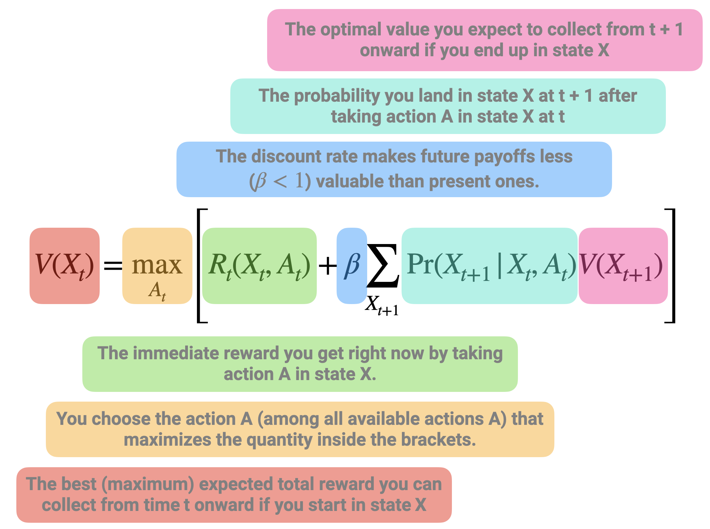
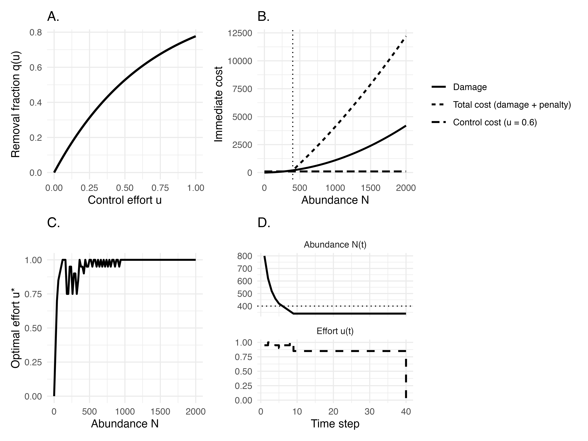
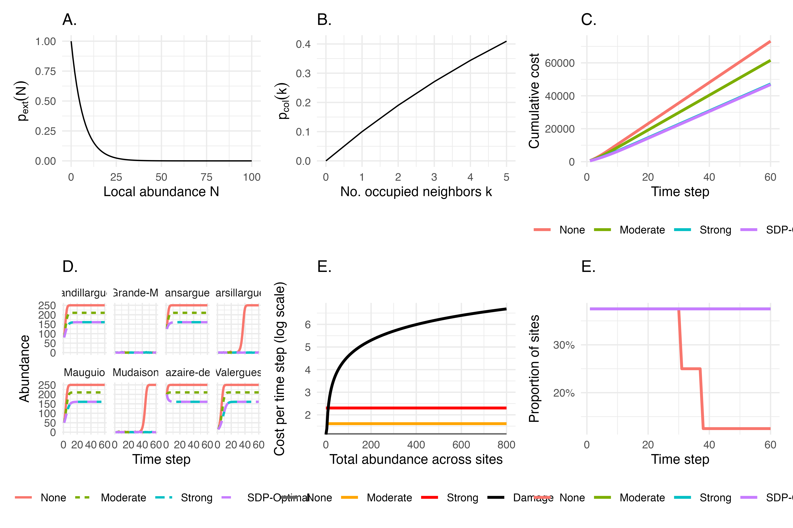
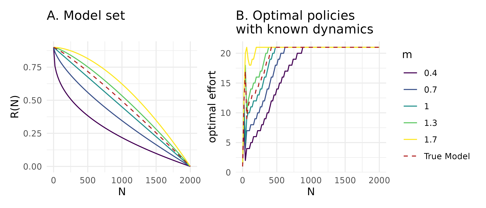
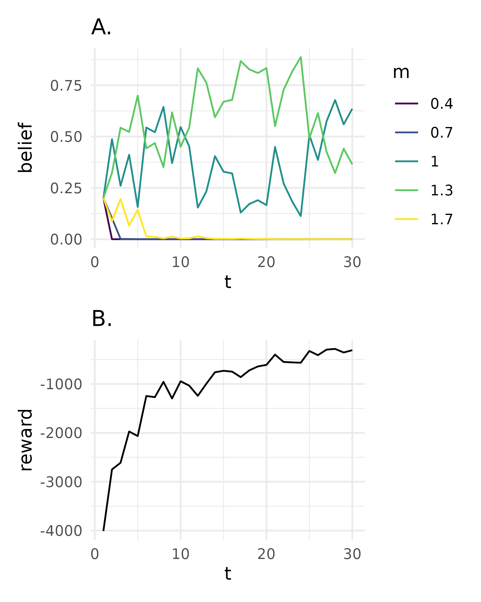
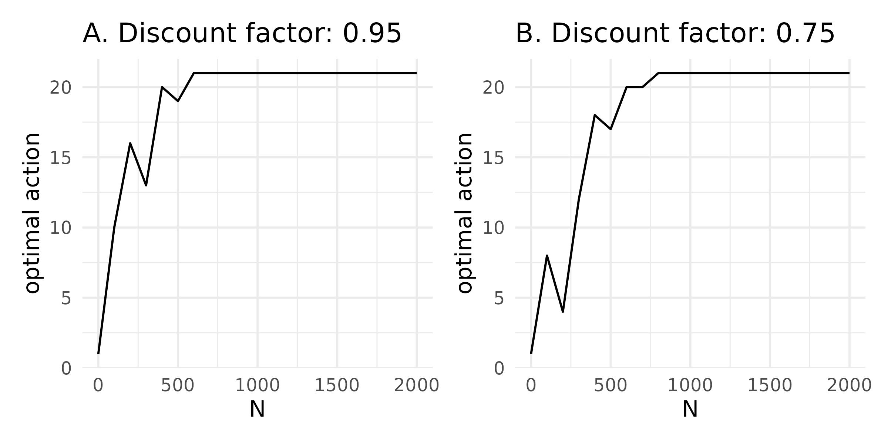

\linenumbers

\small

^1^ CEFE, Univ Montpellier, CNRS, EPHE, IRD, Montpellier, France
^2^ University of California, Berkeley, Berkeley, California, USA
^3^ CBGP, INRAE, IRD, CIRAD, Institut Agro Montpellier, Univ Montpellier, Montpellier, France
^4^ FRB-CESAB, Montpellier, France

`*` Corresponding author: olivier.gimenez@cefe.cnrs.fr

\normalsize

\vspace{1cm}
\hrule

Invasive alien species (IAS) pose significant ecological, economic, and public health challenges. Robust methods are needed for guiding effective management. Overall, we hope to demonstrate the flexibility and utility of structured decision making in invasive species management [Abby: I think of structured decision making as being more about *process* (i.e., PrOACT steps of problem framing, eliciting objectives and alternatives from decision makers, etc), whereas I think what we've done here is given an overview of decision theoretic methods that are useful in one step of the structured decision making process? I think Hemming et al. make some useful definition distinctions: https://doi.org/10.1111/cobi.13868]. 

Target journal: Journal of Animal Ecology

\vspace{3mm}
\hrule
\vspace{5mm}

*Keywords*: Adaptive management, Decision theory, Invasive alien species, Stochastic dynamic programming, Structured decision making, Uncertainty

\newpage

```{r setup, include=FALSE, cache=FALSE, message = FALSE}
library("knitr")
opts_chunk$set(echo = FALSE, warning = TRUE, message = TRUE)
opts_chunk$set(tidy = TRUE, comment = NA, highlight = TRUE)
opts_chunk$set(fig.path = "output/figures/")
```


```{r knitcitations, cache = FALSE}
library(knitcitations)
cleanbib()   
cite_options(citation_format = "pandoc")
```

# Introduction

Invasive species are a major global concern, with wide-ranging impacts on ecosystems, economies, and public health [@Roy2024; @Petr2020]. Their management is inherently challenging, as it requires repeated decisions under uncertainty, limited budgets, and imperfect knowledge of ecological dynamics, which are often characterized by rapid spread, strong population fluctuations, and broad spatial distributions. In practice, managers must decide not only whether to intervene, but also when, where, and how intensively, while balancing short-term operational costs against long-term socio-ecological benefits [@hauserExperimentalPrecautionaryAdaptive2008].

This makes invasive species management a fundamentally dynamic decision problem. Predicting invasion dynamics or mapping risks is not sufficient unless these predictions are explicitly linked to management objectives, feasible actions, and measurable consequences. Decision-making is further complicated by the need to account for multiple, sometimes competing, criteria, including ecological effectiveness, economic costs, operational feasibility, and potential unintended consequences such as non-target impacts. In addition, management actions are embedded in social contexts, where stakeholder perceptions, acceptability of control measures, and underlying environmental values can strongly influence both implementation and outcomes [@crowleyInvasiveSpeciesManagement2017; @simberloffImpactsBiologicalInvasions2013a; @estevezClarifyingValuesRisk2015]

Structured decision-making (SDM) and adaptive management (AM) have long been advocated as frameworks to address the complexity of ecological management problems [@Williams2002; @Thompson2021]. These approaches emphasize the explicit formulation of objectives, the evaluation of alternative actions, and the incorporation of uncertainty into decision processes. However, despite their conceptual appeal, they remain underused in practice, in part because of the technical challenge of formally identifying, quantifying, and optimizing trade-offs among competing objectives over time. Stochastic dynamic programming (SDP), a core tool of decision theory, provides a powerful framework to address this challenge by treating management as a sequential decision problem under uncertainty. In this framework, optimal actions are derived as a function of the current state of the system (e.g. infestation size, spatial extent, or local density), while explicitly accounting for stochastic dynamics and the future consequences of present decisions. SDP naturally accommodates a wide range of management actions, including prevention, surveillance, containment, control, eradication, or inaction, and allows their outcomes to be evaluated in terms of long-term ecological, economic, or social objectives.

SDP has been successfully applied to a variety of invasive species management problems, including optimizing prevention versus control strategies for zebra mussels [@leungOuncePreventionPound2002], designing control policies for invasive plants such as leafy spurge [@hyderEcologySocietyIntegrating2008], identifying state-dependent strategies for spatially structured invasions [@bogichSampleEradicateCost2008], optimizing search effort for invasive insects [@baxterOptimizingSearchStrategies2011], and comparing alternative strategies across invasion stages [@hyytiainenOptimizationFrameworkAddressing2013]. More recent developments, including partially observable Markov decision processes (POMDPs), allow decision-making under imperfect detection, while connections with reinforcement learning highlight promising avenues for scaling these approaches to complex, data-rich systems (e.g. @Haubrock2025) [Abby: Is this paper an example of reinforcement learning for invasive species management?].

Despite these advances, the practical implementation of SDP and related approaches remains limited in applied animal ecology. This gap is partly due to the perceived complexity of these methods and the lack of accessible, step-by-step guidance for translating ecological problems into operational decision models.

In this paper, we aim to bridge this gap by providing a practical guide to the use of stochastic dynamic programming and its extensions for invasive species management. Using the coypu (*Myocastor coypus*) as a running example, we illustrate how to formulate decision problems, implement models, and derive optimal management strategies across a range of ecological contexts, from single populations to metapopulations. We first introduce the core concepts of structured decision making and stochastic dynamic programming through a minimal, fully transparent example. We then develop a series of worked tutorials of increasing complexity, including spatial dynamics, imperfect detection using partially observable Markov decision processes (POMDPs), and model uncertainty addressed through adaptive management. Throughout, we provide reproducible implementations in `R` to facilitate uptake and adaptation by practitioners.

# Explanation of the method

"A very brief historical background. Why is the method useful for investigating or analysing the topic in question? Provide some details on the method’s applications."

We do not want to rewrite Lucile's paper... 

## Structured decision making

[Abby: Maybe a good place to describe structured decision making and how the methods we present are mostly optimization methods useful for evaluating the consequences of actions (i.e., we're not addressing the aspects of SDM such as problem framing, eliciting objectives; we're instead assuming this has already been done)]

Why and what (all)

## Stochastic dynamic programming (Olivier)

```{r fig-bellman, echo=FALSE, out.width='90%', fig.align='center', fig.cap="Schematic representation of the Bellman recursion in stochastic dynamic programming. The value of being in a given state at time $t$, $V(X_t)$, is defined as the maximum, over all possible actions, of two components: (i) the immediate reward obtained by taking action $A_t$ in state $X_t$, and (ii) the expected discounted future value of subsequent states. The latter corresponds to the average (weighted by transition probabilities) of the optimal future values $V(X_{t+1})$ that can be reached from the current state-action pair, scaled by a discount factor $\\beta < 1$ to reflect that future payoffs are less valuable than present ones. This recursive equation highlights the fact that the value of a decision is not only determined by its immediate payoff, but also by how it shapes future opportunities. The optimal action is therefore the one that maximizes the sum of current rewards and expected future benefits."}

```

Here we present a minimal stochastic dynamic programming (SDP) example. The aim is purely pedagogical: to show how states, actions, transition probabilities, rewards, and time horizon combine to produce an optimal decision rule. 

We consider a stylized invasion management problem with three qualitative states describing the invasion level:

- Eradicated: no individuals detected (possible re-invasion risk)
- Contained: invasion present but at low abundance
- Established: invasion widespread with high impacts

At each time step, the manager chooses between two actions:

- Monitor: surveillance only (low cost, little effect)
- Control: active management campaign (higher cost, improves state)

State dynamics are described by action-dependent transition matrices

\[
P_a(s,s') = \Pr(S_{t+1}=s' \mid S_t=s,\; A_t=a).
\]

[Abby: Highlighting that we likely want to make a decision about shared syntax. For example, we use x and s interchangeably for the state]

Transition matrices describe how the invasion state evolves probabilistically from one time step to the next under each management action. Each row corresponds to the current state and each column to the next state, with entries giving transition probabilities. We build a transition matrix for each action. 

Under monitoring, the transition is: 

\[
P_{\text{Monitor}} =
\begin{array}{c|ccc}
 & \text{Erad.} & \text{Cont.} & \text{Estab.} \\
\hline
\text{Erad.} & 0.95 & 0.05 & 0.00 \\
\text{Cont.} & 0.00 & 0.80 & 0.20 \\
\text{Estab.} & 0.00 & 0.00 & 1.00 \\
\end{array}
\]

If the system is eradicated, it remains so with probability 0.95 but may revert to a contained state with probability 0.05, reflecting a small risk of re-invasion. When the invasion is contained, it persists with probability 0.80 but may deteriorate to an established state with probability 0.20, indicating possible population growth without intervention. Once established, the system remains established with probability 1, meaning monitoring alone cannot reverse the invasion. 

In contrast, control shifts the system toward better states:

\[
P_{\text{Control}} =
\begin{array}{c|ccc}
 & \text{Erad.} & \text{Cont.} & \text{Estab.} \\
\hline
\text{Erad.} & 0.98 & 0.02 & 0.00 \\
\text{Cont.} & 0.20 & 0.75 & 0.05 \\
\text{Estab.} & 0.05 & 0.75 & 0.20 \\
\end{array}
\]

From an eradicated state, the system remains eradicated with probability 0.98 and only rarely becomes contained (0.02). When contained, control can eradicate the population (0.20), maintain it at low levels (0.75), or fail and allow establishment (0.05). Finally, when the invasion is established, control improves the situation in most cases, leading to a contained state with probability 0.75, occasionally achieving eradication (0.05), but sometimes failing to reduce impacts (remaining established with probability 0.20). 

Together, these transition matrices encode both ecological uncertainty and the imperfect effectiveness of management actions.

Next we define rewards. Rewards are defined as the negative of total costs, so that maximizing expected reward is equivalent to minimizing management and damage costs. 

\[
R(s,a) = -(\text{damage}(s) + \text{cost}(a)).
\]

Damage depends on the invasion state (higher when the invasion is established), while management cost depends on the chosen action (higher for active control than monitoring). The reward matrix is constructed by combining these two components for all state–action pairs, yielding the immediate payoff used in the dynamic programming recursion.

\[
R =
\begin{array}{c|cc}
 & \text{Monitor} & \text{Control} \\
\hline
\text{Erad.} & -1  & -6  \\
\text{Cont.} & -5  & -10 \\
\text{Estab.} & -15 & -20 \\
\end{array}
\]

(Rows correspond to the current invasion state and columns to the management action.)

For example, when the invasion is eradicated, monitoring yields a reward of -1, reflecting only minor surveillance costs, whereas applying control in the same state yields -6 due to higher intervention costs. When the population is contained, rewards are -5 for monitoring and -10 for control, representing moderate damages combined with the respective management costs. Finally, when the invasion is established, rewards drop to -15 under monitoring and -20 under control, reflecting both high ecological impacts and, in the latter case, substantial intervention effort. Overall, this reward structure captures the short-term trade-off between ecological impacts and management effort that underlies the decision problem.

Solving the finite-horizon decision problem yields the optimal value function $V_t(s)$, which represents the expected cumulative reward (i.e., negative total cost) obtained when starting from state $s$ at time $t$ and following the optimal policy thereafter. Values are more negative when the invasion is established, reflecting higher expected damages. Moreover, values increase (become less negative) as the horizon shortens because fewer future costs can accumulate. 

\[
V_t(s) =
\begin{array}{c|cccccc}
 & t=1 & t=2 & t=3 & t=4 & t=5 & t=6 \\
\hline
s = \text{Erad.} & -7.60 & -5.50 & -3.69 & -2.20 & -1 & 0 \\
s = \text{Cont.} & -33.78 & -27.43 & -19.96 & -12.0 & -5 & 0 \\
s = \text{Estab.} & -49.26 & -42.05 & -34.47 & -26.8 & -15 & 0 \\
\end{array}
\]

The associated optimal policy $\pi_t(s)$ specifies the best action to take in each state $s$ at each time step $t$. Overall, the policy indicates that monitoring is typically optimal when the system is eradicated, whereas control is recommended when the invasion is established due to the high expected damages. In the contained state, the optimal decision varies with the time horizon, reflecting the trade-off between immediate intervention costs and the risk of future deterioration.

\[
\pi_t(s) =
\begin{array}{c|ccccc}
 & t=1 & t=2 & t=3 & t=4 & t=5 \\
\hline
s =\text{Erad.} & \text{Monitor} & \text{Monitor} & \text{Monitor} & \text{Monitor} & \text{Monitor} \\
s = \text{Cont.} & \text{Control} & \text{Control} & \text{Monitor} & \text{Monitor} & \text{Monitor} \\
s = \text{Estab.} & \text{Control} & \text{Control} & \text{Control} & \text{Control} & \text{Monitor} \\
\end{array}
\]

This toy example highlights key features of SDP:

- **State dependence**: optimal decisions depend on invasion level.
- **Trade-off**: control is costly but reduces future risk.
- **Time horizon effects**: as the horizon shortens, actions may become more short-term oriented.
- **Uncertainty**: decisions account for probabilistic transitions, not deterministic outcomes.

# Things to consider for before using this method

Applying stochastic dynamic programming (SDP) to ecological problems requires careful formulation of the decision context, as well as practical considerations regarding model structure, data, and computation.

## Problem formulation

A prerequisite for SDP is a clear definition of the decision problem. This includes specifying management objectives, identifying feasible actions, defining the state variables that describe the system, and constructing a reward function that captures the trade-offs among ecological, economic, and social outcomes. Because SDP optimizes decisions given these elements, poorly specified objectives or unrealistic action sets can lead to misleading recommendations.

## State definition and discretization.

SDP typically requires a finite state space, whereas ecological systems are often described by continuous variables (e.g. abundance, spatial extent). Discretization is therefore necessary, but introduces a trade-off between realism and tractability. Fine discretization improves accuracy but increases computational cost, while coarse discretization may obscure important system dynamics. Careful sensitivity analyses are often needed to ensure robust conclusions.

## Model specification and uncertainty.

The performance of SDP depends on the specification of transition dynamics and reward functions, which are often uncertain in ecological systems. These uncertainties may arise from limited data, structural assumptions, or imperfect knowledge of management effectiveness. Ignoring uncertainty can result in suboptimal policies, motivating extensions such as adaptive management or partially observable Markov decision processes (POMDPs), which explicitly account for learning and imperfect information.

## Computational constraints.

A major limitation of SDP is the “curse of dimensionality”, whereby the size of the state and action space grows rapidly with system complexity. This can restrict the number of state variables, spatial resolution, or management options that can be included in a model. In practice, this often requires simplifying assumptions, state aggregation, or the use of simulation-based approaches to approximate optimal policies.

## Data requirements and interpretation.

Although SDP can be implemented using simple or expert-based models, its relevance depends on the availability and quality of data describing system dynamics, management effects, and costs. In data-limited contexts, SDP may still provide valuable qualitative insights into decision structure and trade-offs, but quantitative recommendations should be interpreted with caution.

# Worked examples

"Papers should include at least two tutorials, with a step-by step demonstration of the method. Figures and mathematical formulations are particularly useful here. Where possible, tutorials and examples should include those using the R statistical package or other freeware."

Here explain that we use coypu IAS in Europe as a "fil rouge". 

## Single population (Olivier)

The objective of this example is to determine an optimal regulation policy for coypu based on their total abundance. We consider a stylized management problem in which a decision maker chooses, at each time step, the intensity of a control effort \(u \in [0,1]\). Low effort corresponds to minimal intervention, while high effort represents intensive removal. The management objective is to balance three competing components: ecological damages that increase with population size (e.g. crop losses, dike weakening, nuisance), management costs that increase with effort, and an additional penalty if abundance exceeds a tolerable level.

In contrast to the previous example with discrete invasion states, the system is here described by a continuous state variable, the population size \(N\). Because dynamic programming requires a finite state space, abundance is discretized onto a grid ranging from 0 to the carrying capacity \(K\). In the implementation, we set \(K=2000\) individuals and use a grid step of 20 individuals. Control effort is also discretized, from 0 to 1 in increments of 0.05. 

Population dynamics follow a density-dependent growth model with removals due to control,
\[
N_{t+1} = N_t + rN_t\left(1-\frac{N_t}{K}\right) - q(u)N_t ,
\]
where the first term describes logistic growth and \(q(u)\) is the fraction of individuals removed as a function of effort. We use a somehow saturating removal function,
\[
q(u)=1-\exp(-\alpha u),
\]
with \(\alpha=1.5\), which implies diminishing returns of control effort (Figure \@ref(fig:fig-removal-fraction)). For example, an effort of \(u=0.5\) removes about 53% of the population, whereas maximum effort \(u=1\) removes about 78%, reflecting the fact that complete eradication is rarely achievable in a single step. 

```{r fig-pop, fig.cap="General title. (a). Removal fraction $q(u)$ as a function of control effort u. (b) Immediate cost components as functions of abundance. Damage increases nonlinearly with population size, leading to rapidly rising total costs (damage + penalty). The dotted line marks the tolerable threshold ($N_tol = 400$) above which an additional penalty is applied in the decision model, although it is not shown here for clarity. Control cost is illustrated for an example effort level ($u = 0.6$). (c) Optimal policy $u*(N)$ starting from $N0 = 800$. (d) An example trajectory under the optimal policy, facetted into abundance and effort, starting from $N0 = 800$.", echo=FALSE, out.width="100%"}

```

Rewards are defined as the negative of total costs, so that maximizing expected reward is equivalent to minimizing long-term damages and management expenses (Figure \@ref(fig:fig-cost-components)):
\[
R(N,u)=-(\text{damage}(N)+\text{cost}(u)+\text{penalty}(N)).
\]
Damages increase non-linearly with abundance, here using a simple quadratic form \(\text{damage}(N)=0.1 N + 0.001 N^2\), reflecting the common ecological pattern whereby impacts accelerate at high density. Management costs increase with effort and are assumed convex (\(\text{cost}(u) = 50 u + 200 u^2\)), capturing increasing marginal costs of intensive interventions. Finally, a penalty is applied when abundance exceeds a tolerable threshold \(N_{\text{tol}} = 400\), representing situations where ecological or social impacts become unacceptable. The penalty increases linearly beyond this threshold according to

\[
\text{penalty}(N) =
\begin{cases}
0, & N \le N_{\text{tol}}, \\
2000\,\dfrac{N - N_{\text{tol}}}{N_{\text{tol}}}, & N > N_{\text{tol}} .
\end{cases}
\]

This formulation implies that the penalty is zero below the threshold and then rises proportionally to the exceedance. For example, an abundance of \(N = 800\) yields a penalty of 2000, thereby strongly incentivizing control once populations grow beyond acceptable levels.

<!-- Given the current abundance and chosen effort, the next state is uniquely determined by the ecological model and the discretization step, so transitions are deterministic on the state grid. Although simplified, this structure provides a transparent link between ecological processes and decision making, and could easily be extended to include environmental stochasticity. -->

The decision problem is solved using infinite-horizon discounted value iteration (with discount factor \(\gamma=0.99\)). The resulting value function represents the expected long-term net benefit of starting from each abundance level when optimal decisions are applied thereafter. The optimal policy \(u^{\*}(N)\) typically exhibits a threshold-like pattern: low effort at low abundance where damages are limited, progressively stronger intervention as abundance increases, and intensive control once the population approaches or exceeds the tolerable level. This behavior reflects a general ecological intuition — management intensity should scale with both population size and risk — and illustrates how stochastic dynamic programming formalizes this principle within a transparent decision framework.

The decision problem is solved using infinite-horizon discounted value iteration (discount factor \(\gamma = 0.99\)). This yields (i) an optimal stationary policy, mapping each abundance class to a recommended control effort, and (ii) a value function (not shown) that summarizes the long-term expected net benefit when the policy is followed.

Because damages and the penalty increase sharply with abundance, the optimal rule is “threshold-like” (top panel in Figure \@ref(fig:fig-policy-and-trajectory)). Effort is low at small \(N\), then increases rapidly as \(N\) approaches the tolerable threshold \(N_{\text{tol}}=400\), and remains high for large \(N\). Ecologically, this tells us that when the population is small, impacts are limited and additional control has diminishing returns, whereas once abundance enters an unacceptable zone, strong intervention is warranted to prevent sustained high impacts.

The bottom panel of Figure \@ref(fig:fig-policy-and-trajectory) illustrates the dynamical consequences of applying this rule to a trajectory starting from \(N_0=800\). Control effort \(u(t)\) adjusts immediately to the current abundance class, and abundance \(N(t)\) responds through the logistic dynamics with removals. In this deterministic grid-based version, the system typically moves quickly toward a lower-abundance regime and then stabilizes around a band where the marginal benefit of additional control balances its marginal cost. 


## Metapopulation (Olivier)

We extend the single-population coypu example to a spatially structured invasion in which several sites are connected through dispersal. The aim is to explore how management effort should vary through time when local demographic processes and spatial spread interact. We consider a network of several sites that can be interpreted as cities or management units. At each monthly time step, a decision maker chooses a global management action corresponding to a harvest intensity applied simultaneously across all sites. Local populations then grow according to density dependence, are partially removed by management, and may subsequently undergo stochastic extinction or colonization depending on local abundance and the occupancy of neighboring sites.

At time \(t\), each site \(i\) is either occupied or empty, represented by the binary variable \(X_i(t)\in\{0,1\}\). When a site is empty its abundance is zero, whereas when it is occupied its population size follows discrete logistic growth with intrinsic rate \(r\) and carrying capacity \(K\). Denoting abundance by \(N_i(t)\), post-growth abundance is

\[
N_i^{\text{grow}}(t+1)
= N_i(t) + r\,N_i(t)\!\left(1-\frac{N_i(t)}{K}\right).
\]

Management then removes a fraction \(h_a\) of the population, so that

\[
N_i(t+1) = N_i^{\text{grow}}(t+1)\,(1-h_a).
\]

This formulation captures the idea that control reduces numbers but does not eliminate underlying demographic regulation.

Occupancy is updated stochastically based on local abundance and spatial context (Figure \@ref(fig:show-prob-curves)). When a site is occupied, extinction probability decreases with abundance according to

\[
p_{\text{ext}}(N_i) = \exp(-\alpha N_i),
\]

so that small populations are more vulnerable to disappearance. When a site is empty, colonization probability increases with the number of occupied neighbors

\[
k_i(t)=\sum_{j\neq i} A_{ij} X_j(t),
\]

through

\[
p_{\text{col}}(k_i) = 1-(1-\beta)^{k_i}.
\]

Together, these rules link local demography with spatial dynamics and create feedbacks between sites.  

```{r fig-metapop, fig.cap="General title. (a) Extinction $p_{ext}(N)$. (b) Colonization  $p_{col}(k)$. (c) Cumulative cost: constant vs SDP-optimal strategies. Representation of the cost components on the log scale. Damage costs increase linearly with total abundance across sites, whereas control costs are fixed action-specific intercepts (none/moderate/strong). Stronger control increases immediate spending but can reduce future abundance and damages. (c) Optimal global action as a function of time and invasion level (measured as the number of occupied sites). Colors indicate the action recommended by the finite-horizon SDP (None/Moderate/Strong). This visualization highlights how stronger control becomes optimal as the invasion occupies more sites, and how recommendations may soften near the end of the planning horizon. (d) Cumulative costs over time under constant strategies (none, moderate, strong) versus the SDP-optimal policy. Costs combine damages proportional to total abundance and an action-specific control cost. (e) Site-level abundance dynamics under constant strategies and the SDP-optimal policy. Each panel corresponds to a site; trajectories highlight how spatial heterogeneity and network-driven recolonization can create uneven benefits of control across locations. (e) Containment success (sites with $\\le 5$ coypus).", echo=FALSE, out.width="100%"}

```

Because the transition probabilities induced by these ecological rules are analytically intractable, we approximate them using repeated simulations. Starting from a given state and management action, we simulate the ecological dynamics many times and record the frequency of each possible next state. In practice, the estimated probability of transitioning from state \(s\) to state \(s'\) under action \(a\) is the proportion of simulations that lead to \(s'\):

<!-- \[ -->
<!-- \hat p_a(s,s') = \frac{\text{number of simulated transitions from } s \text{ to } s'}{\text{total number of simulations}}. -->
<!-- \] -->

This Monte Carlo approach allows the decision model to incorporate nonlinear and stochastic ecological processes without requiring an explicit analytical expression for transition probabilities.

Management decisions are evaluated through a cost function that balances ecological damages and intervention effort (Figure \@ref(fig:fig-tradeoff)). At each time step, total cost is defined as

\[
C(s,a) = c_d \sum_{i=1}^n N_i(t) + c_a(a),
\]

where \(c_d\) represents the damage cost per individual (here \(c_d = 1\)) and \(c_a(a)\) is the management cost associated with action \(a\). In this example, we consider three possible actions corresponding to no control, moderate control, and strong control, with costs

\[
c_a(a) \in \{0,\;5,\;10\}.
\]

The reward used in the dynamic programming recursion is defined as the negative of this cost,

\[
R(s,a) = -C(s,a),
\]

so that maximizing expected reward is equivalent to minimizing long-term total costs.

The resulting policy is illustrated in Figure \@ref(fig:fig-policy-heatmap). When few sites are occupied and populations remain small, limited intervention is often sufficient because damages are modest and extinction may occur naturally. As more sites become occupied or local abundances increase, stronger control becomes optimal in order to reduce future spread and prevent escalating impacts. Temporal variation in recommended actions arises because the finite planning horizon reduces the benefit of aggressive intervention late in the time period.

Comparing forward simulations under the optimal policy with simulations under constant strategies highlights the value of adaptive management (Figure \@ref(fig:fig-cum-costs)). The optimal strategy typically reduces cumulative costs by applying effort strategically in time rather than maintaining a fixed level of control.  

Spatial trajectories further illustrate how coordinated management alters invasion dynamics across the network, with reductions in abundance and occupancy emerging progressively across sites (Figure \@ref(fig:fig-site-dynamics)).  

In perspective, say that this can be used to model competition or predator-prey, or host-pathogen / disease thing. See SDP-species-interactions/ in Olivier biblio repo.


## Acounting for observation error w/ POMDP (Cassie)

Illustrate POMDP. 

<https://besjournals.onlinelibrary.wiley.com/doi/10.1111/2041-210X.14374>
<https://besjournals.onlinelibrary.wiley.com/doi/10.1111/2041-210X.13692>

In an ideal world, invasive species management would be based on perfect knowledge of the state of the system. Yet ecological systems are inherently difficult to monitor, leading to imperfect knowledge of the system and its state. While ongoing monitoring can reduce uncertainties associated with the state of the system, invasive species management often requires timely decisions. In these cases, partially observable Markov decision process (POMDP) models can be used. POMDPs build on MDPs, dealing with uncertainty in both the model and state of the system. However, POMDPs are more computationally and mathematically challenging to solve due to the continuous and high-dimensional state space. A detailed primer on developing POMDPs for ecological problems already exists (Chades et al 2021), so here we will keep our description simple. 

POMDPs differ from MDPs by including an observation state (O), observation function (Z), and initial belief state ($b_0$). The observation state includes the set of observations perceived by the manager, while the observation function represents the conditional probability of a manager observing o' given that action a lead to state s'. In cases where state uncertainty cannot be reduced, the observation function is independent from the actions taken, and thus dependent only on state s'. The initial belief represents the believed state of the system at a given time.

Because the states are themselves unobservable, the state of the system must be tracked with belief states. At any point in time, the actual (unobservable) state of the system influences the immediate returns, state transitions, and observations, but do not influence actions. The belief state is updated based on observations, which subsequently inform the action(s) to be selected. Lastly, actions drive the state transitions, rewards, and may influence the observations.

[I think having a diagram to show the difference between MDP and POMDP, like Figure 1 in Chades et al 2021 or Fig 2-3 in Williams & Brown 2022, could be helpful]
[Also from Chades et al 2021: "In the language of statistics, POMDPs are models that describe optimal control of hidden Markov models (HMMs). In this framing, the partially observed states of the model are latent variables that are inferred from the (fully observable) observation states."]

Chades et al (2021) identified three types of management problems that POMDPs can be used to solve: 
- Exploiting current knowledge or reducing uncertainty: Classic dilemma where managers have to choose between investing in reducing state uncertainty or exploiting current knowledge. 
- Managing under imperfect detection: Assumes that managers have no means of reducing uncertainty, but managers can invest in management actions for which effectiveness varies across the state space.
- Adaptive management: Where the dynamics of the system are not observable.
The authors included an example for the first type of problem from a conservation perspective. Here, we'll focus on an example for managing under imperfect detection, continuing with our coypu case study. 

Going back to a simple example in invasive species management, imagine we have .... 
Occupancy model with uncertain detectability

The invasive species can either be established or absent, with possible observations defined as present or absent denoting if the species was observed in a given time step. 

Partially observable Markov decision processes (POMDPs) extend the standard Markov decision process framework to situations in which the true state of the system is not known with certainty. This is particularly relevant for invasive species management, where managers rarely know the exact status of an invasion. Absence of observations does not necessarily mean true absence, and management decisions often have to be made from imperfect monitoring data.

Here, we illustrate the approach with a deliberately simple toy example inspired by coypu (*Myocastor coypus*) management. The system can occupy one of three ecological states:

\[
s_t \in \{\text{Eradicated}, \text{Contained}, \text{Established}\}.
\]

These states represent a gradient from no animals present, or at least no animals remaining after management, to a low-abundance contained population, and finally to an established population generating high ecological or socio-economic damage. At each time step, the manager chooses one of three actions:

\[
a_t \in \{\text{Do nothing}, \text{Fertility control}, \text{Lethal control}\}.
\]

Each action affects the probability that the system moves from its current state to a future state. This is described by a transition matrix:

\[
P_a(s,s') = \Pr(s_{t+1}=s' \mid s_t=s, a_t=a),
\]

where rows correspond to current states and columns to next states. For example, doing nothing is cheap but allows contained populations to become established, while an established population remains established in the absence of control. Fertility control partially reduces invasion pressure, whereas lethal control gives the highest probability of moving the system back towards the eradicated or contained states.

Unlike a fully observable MDP, the manager does not directly observe the state \(s_t\). Instead, they receive an observation:

\[
o_t \in \{\text{Absent}, \text{Present}\}.
\]

The observation process is governed by detection probabilities:

\[
O_a(s,o) = \Pr(o_t=o \mid s_t=s, a_t=a).
\]

In the example, detection depends both on the true state and on the action taken. Detection is lower when no management is implemented, reflecting reduced monitoring effort. In contrast, both fertility control and lethal control are assumed to involve field activities that increase the probability of detecting coypu. Detection also increases with invasion status: observations of presence are more likely when the population is established than when it is contained.

Because the true state is uncertain, decisions are based on a **belief state**, denoted \(b_t\). This belief state is a probability distribution over the possible ecological states:

\[
b_t(s) = \Pr(s_t=s \mid \text{past actions and observations}),
\]

with

\[
\sum_s b_t(s) = 1.
\]

For instance, a belief state such as

\[
b_t = (0.10, 0.15, 0.75)
\]

means that, given all available information, the manager assigns probabilities 0.10, 0.15 and 0.75 to the system being eradicated, contained and established, respectively. In ecological terms, the manager strongly suspects that the invasion is established, but still acknowledges uncertainty.

The objective is to choose actions that maximise expected long-term reward. Rewards combine ecological or socio-economic damage and management cost. In this example, the reward is defined as a negative cost:

\[
R(s,a) = -\{D(s) + C(a)\},
\]

where \(D(s)\) is the damage associated with state \(s\), and \(C(a)\) is the cost of action \(a\). Thus, higher rewards correspond to better outcomes, because they represent lower total damage and lower management cost. Eradication has no damage, containment has moderate damage, and establishment has high damage. Doing nothing has no management cost, fertility control has an intermediate cost, and lethal control has the highest cost.

The POMDP solution identifies an optimal policy, that is, a rule mapping belief states to actions:

\[
\pi^*(b_t) = \arg\max_a \; V(b_t,a),
\]

where the value of a belief state is the maximum expected discounted reward over current and future decisions:

\[
V(b_t) = \max_{a_t} \left[ \sum_s b_t(s) R(s,a_t)
+ \gamma \sum_o \Pr(o_{t+1}=o \mid b_t,a_t) V(b_{t+1}) \right].
\]

Here, \(\gamma\) is the discount factor, set to 0.95 in the example, meaning that future outcomes are valued almost as much as immediate outcomes. The updated belief state \(b_{t+1}\) is obtained by combining the transition model and the observation model using Bayes' rule. In words, the manager first predicts how the system may change under the chosen action, then updates their belief after observing whether coypu are detected or not.

The model can be solved using standard POMDP algorithms. In the code, the same problem is implemented with the `pomdp` package and with `sarsop`. The solution is represented by a set of \(\alpha\)-vectors. For any belief state \(b\), the value of each candidate policy vector is obtained by a dot product:

\[
V_i(b) = b^\top \alpha_i,
\]

and the optimal action is the one associated with the vector giving the highest value:

\[
\pi^*(b) = a_{i^*}, \qquad i^* = \arg\max_i b^\top \alpha_i.
\]

This makes the example useful pedagogically: rather than assuming that the invasion status is known, the decision explicitly depends on the manager's uncertainty. When the belief state places high probability on establishment, more intensive control may become optimal despite its higher immediate cost. Conversely, if the system is probably eradicated or only weakly invaded, the optimal policy may favour less costly actions. The POMDP therefore formalises a key challenge in invasive species management: acting adaptively when both ecological dynamics and monitoring information are uncertain.

## Reducing model uncertainty w/ adaptive management (Abby)

Decision theoretic methods can be used to make control decisions not only in the face of uncertainty, but also to reduce uncertainty over time. Adaptive management, or “learning by doing”, involves making decisions to achieve a management objective while simultaneously learning about system dynamics to improve future management success [@holling1978adaptive; @walters1986adaptive; @conroy2013decision]. Adaptive management approaches differ based on whether they learn only from the past (passive adaptive management) or anticipate future learning (active adaptive management) [@chades2017optimization].

Here we apply adaptive management strategies to inform control decisions for a single coypu population and to learn about and reduce uncertainty in the per-capita growth rate. We will use the following discrete-time population model, where $r$ is the intrinsic rate of growth; $K$ is the carrying capacity; $q(u)$ is the harvest rate as a function of action $u$; $R$ is the per-capita growth rate; $m$ describes whether the per-capita growth rate is linear, concave, or convex; and $\epsilon$ is log-normally distributed noise:

$$
N_{t+1} = N_t(1 + R(N_t)) - q(u) \times N + \epsilon
$$
$$
R(N_t) = r \times (1 - (N_t / K) ^ m)
$$

If $m > 1$, most density—dependent change occurs at high population levels (close to the carrying capacity), which is theoretically common for species with life history strategies typical of large mammals. If $m < 1$, most density-dependent change occurs at low population levels, which is theoretically common for species with life history strategies typical of insects and some fishes [@fowler1981density].

We will consider a model set with five possible values of $m$. This model bounds, but does not contain, the true model we will use to simulate dynamics in the passive adaptive management approach (Figure 1A). These different values of $m$ result in different optimal policies when system dynamics are known perfectly (Figure 1B).

```{r model-set, fig.cap="$A.$ Model set representing structural uncertainty in the per-capita growth rate. $B.$ Optimal state-dependent removal actions assuming perfectly known population dynamics, solved with stochastic dynamic programming. In both panels, colors correpond to different values of $m$ in the model set, and the red dashed line corresponds to the true model dynamics used for simulation in the passive adaptive management approach.", out.width="90%", fig.align="center", fig.pos = "H", echo = FALSE}


```


## Value of Information

For a decision maker, uncertainty may not be important to resolve; learning may not be inherently valuable if it does not result in improved management outcomes. A Value of Information (VoI) analysis *a priori* quantifies the importance of reducing uncertainty, or the expected improvement on management objectives if uncertainty were resolved [@raiffa2000applied]. If the VOI is high, an adaptive management approach is typically justified.

The expected value of perfect information (EVPI) is measured as the difference between 1) $PI$, or the expected value once uncertainty has been resolved because the optimal action is chosen after knowing which model best describes the system, and 2) $NL$, or the expected value in the face of uncertainty because the optimal action is chosen with no learning about the system [@runge2011uncertainty]. The difference between these terms, $\text{EVPI} = PI - NL$, is the expected improvement in management performance due to acquiring perfect information.

To calculate EVPI for a sequential decision problem, we first use SDP to calculate the optimal state-dependent policy with assumed system dynamics, $\pi^*(s)_k$, for each model $k$ in the model set $K$, given each transition matrix, $P_k$. We also calculate the bet-hedging strategy, or the optimal policy given uncertain dynamics, $\pi^*(s)_{NL}$. This bet-hedging strategy is calculated with the transition matrix $P_{NL}$, representing the average of the transitions of each model, $P_k$, weighted by each model belief, $b$: $P_{NL}(s_{t+1}|s_t, a_t) = \sum_{k\in K}b(k)P_k(s_{t+1}|s_t, a_t)$.

Using the policies calculated with known dynamics, $\pi^*(s)_k$, and unknown dynamics, $\pi^*(s)_{NL}$, we find the EVPI by first simulating $i$ replicated population trajectories assuming each model $k$, applying both policies with known and unknown dynamics, and calculating the value at time $t$ over time horizon $T$. The value associated with applying the policy with known dynamics is $V_{k,t,i}(s_t, a_t | a_t = \pi^*(s)_k)$, and the value associated with applying unknown dynamics is $V_{k,t,i}(s_t, a_t | a_t = \pi^*(s)_{NL})$. The EVPI is therefore $E_{s,k,t,i}[V(s_t, a_t | a_t = \pi^*(s)_k)] - E_{s,k,t,i}[V(s_t, a_t | a_t = \pi^*(s)_{NL})]$.

In the context of coypu regulation, the EVPI represents the expected improvement on the management objective if uncertainty about the per-capita growth rate was reduced. We calculate the EVPI for a model set, $K$, where $m \in \{0.4, 0.7, 1, 1.3, 1.7\}$ for $I = 200$ iterations over a $T = 40$ time horizon. We assume equal belief in each model. The expected value once uncertainty has been resolved, $PI$, is -1730.4, the expected value with no learning, $NL$, is -1787.8, and the EVPI is $PI - NL = 57.4$. It is therefore valuable to learn about the population dynamics and per-capita growth rate, as this learning is expected to improve performance on the management objective.

Value of information analyses are typically applied for static, one-time conservation decisions, rather than sequential problems, often in the context of understanding when to act and when to delay action until after further research [@bolam2019using]. To better understand the value of information in the context of adaptive management, future work should investigate quantifying VOI by iteratively resolving uncertainty, requiring evaluating the gain of implementing an adaptive policy rather than a single action [@chades2017optimization].

## Passive adaptive management

Passive adaptive management involves learning from the outcomes of previous management actions to update knowledge about system dynamics and improve management performance over time. Decisions at each time step are optimized assuming that current knowledge of the system will not change into the future. Learning therefore occurs by monitoring the effect of an implemented action, rather than during the optimization procedure [@chades2017optimization].

Solving a passive adaptive management problem includes an implementation step and an updating step at every time point $t$, based on the current belief in model $k$, $b_t(k)$. The MDP must be solved at every time step because the transition matrices change as the belief changes. During the implementation step, the optimal action at time $t$ is selected using a weighted averaging approach, where the transition probabilities are averaged across all models with the weights given by the current belief, $b_t(k)$ [@williams2011adaptive]. This can be solved using stochastic dynamic programming:

$$
V^*(s_t|b_t) = \text{max}_{a \in A} \left\{ \sum_{k \in K}b_t(k)r(s_t, a_t) + \gamma \sum_{s_{t+1}} \left\{\sum_{k\in K}b_t(k)P_k(s_{t+1}|s_t, a_t) \times V^*(s_{t+1}|b_t)\right\} \right\}
$$

During the updating step, the resulting state, $s_{t+1}$, after taking action $a_t$ is observed, and belief, $b_{t+1}$, is updated according to Bayes’ rule:

$$
b_{t+1}(k|s_t, a_t, s_{t+1}, b_t) = \frac{P_k(s_{t+1}|s_t,a_t)b_t(k)}{\sum_{k \in K}P_k(s_{t+1}|s_t,a_t)b_t(k)}
$$

For coypu control decisions, we solve the passive adaptive management problem by updating the belief about the coypu population dynamics to improve management performance over time. We begin with an equal belief, $b_{t=1}(k) = 1 / 5$, across the five models in the model set (Figure 1A). We iterate between 1) calculating the optimal action given the current belief state, 2) implementing the optimal action and simulating the next state, $s_{t+1}$, given the true population dynamics, and 3) updating the belief state based observing the next state given action $a_t$. Here we assume the state is perfectly observed. We simulate the application of passive adaptive management over 30 time steps. The belief in each model changes over time (Figure 2A), resulting in the highest belief for the two models closest to the true population dynamics $m = 1$ and $m = 1.3$ (Figure 1A). Through updating the belief state over time and implementing the optimal action given the current belief state, the management performance improves over time (Figure 2B). 


```{r passive-plot, fig.cap="$A.$ Belief state for each model $k$ at time $t$. Colors correspond to different values of $m$, representing structural uncertainty in the per-capita growth rate. $B.$ Reward, $r(s_t,a_t)$, at time $t$ in passive adaptive management problem.", out.width="60%", fig.align="center", fig.pos = "H", echo = FALSE}


```


## Active adaptive management

In contrast to passive adaptive management, active adaptive management does not rely only on past experience and instead explicitly accounts for future learning opportunities to maximize the chance of achieving the objective. Instead of an optimization at every time step as in passive adaptive management, the optimization occurs once and requires that the trajectory of belief $b_t$ to $b_{t+1}$ and state transitions be calculated for all time steps [@chades2017optimization]. The optimal value function $V^*$ that characterizes the performance of a policy is a function of both the state of the system $s_t$ and belief over the models $b_t$:

$$
V^*(s_t,b_t) = \text{max}_{a \in A} \left\{ \sum_{k \in K}b_t(k)r(s_t, a_t) + \gamma \sum_{s_{t+1}} \left\{\sum_{k\in K}b_t(k)P_k(s_{t+1}|s_t, a_t) \times V^*(s_{t+1},b_t)\right\} \right\}
$$

Active adaptive management with model uncertainty can be solved with many methods, including those developed for dealing with partial observability [@chades2017optimization; @williams2011adaptive]. Here, a POMDP is characterized by a tuple $〈X, A, O, P, Z, r, \gamma〉$, where $X = S \times K$ represents the factored state space with $S$ denoting the possible conditions of the system and $K$ denoting the model set. The unknown model is an unobserved state variable that must be inferred through observation. We can solve the POMDP with the Successive Approximations of the Reachable Space under Optimal Policies (SARSOP) algorithm [@kurniawati2008sarsop]. With this algorithm, the value function $V^*$ associated with the optimal policy $\pi^*$ can be approximated by a convex, piecewise-linear function $V(b) = \text{max}_{\alpha \in \Gamma}(\alpha \cdot b)$, where $\Gamma$ is a finite set of $\alpha$-vectors and $b$ is the discrete vector representation of a belief [@kurniawati2008sarsop].

For coypu control decisions, we solve the active adaptive management problem by augmenting the state space with the belief in two models where $m \in \{0.7, 1.3\}$. We choose a smaller model set than in the passive adaptive management problem due to the computational cost associated with exploring the belief and state spaces over the entire time period (i.e., "curse of dimensionality"). We assume a uniform belief across models and assume perfect observation of the state (i.e., $o_t = s_t$).

We also use the coypu example to demonstrate the "dual control problem" [@walters1978ecological]. A management action altering a poorly understood system can produce two types of benefits: 1) short-term payoffs and 2) learning about the system so as to improve payoffs in the long-term. There is a trade-off between these two benefits, as large disturbances allow for rapid learning yet may incur high costs; the challenge is to optimally balance these benefits. Here we explore the dual control problem by selecting two different discount factors, $\gamma \in \{0.95, 0.75 \}$. The higher of which represents a decision maker who values long-term rewards more highly, and the lower of which represents a decision maker who values short-term rewards more highly.

The active adaptive management solution describes the optimal action ($a_t$, removal effort), given the state ($s_t$, coypu abundance), initial belief ($b_{t=1}$, uniform across models), and discount factor (Figure 3). The solution differs depending on how future rewards are discounted in the optimization. At low coypu abundance, the optimal removal effort increases as the discount factor increases. With a higher discount factor, future system states are valued more highly; even though a higher removal effort is costly today, this higher removal effort will accelerate learning to yield higher rewards in the long term (Figure 3A). In contrast, with a lower discount factor, active learning becomes less useful, as the price paid for not following the passive-adaptive (optimal right now) solution exceeds the information gained from learning (Figure 3B).

```{r active-plot, fig.cap="$A.$ State-dependent active adaptive management solution, given an initial uniform belief across models and a higher discount factor representing a decision maker who values long-term payoffs more highly. $B.$ State-dependent active adaptive management solution, given an initial uniform belief across models and a lower discount factor representing a decision maker who values short-term payoffs more highly.", out.width="90%", fig.align="center", fig.pos = "H", echo = FALSE}


```

On a single species ; check out Conroy's book, there is a nice figure illustrating AM. 

<https://onlinelibrary.wiley.com/doi/10.1002/ece3.71176>

# Discussion (all)

## Main messages

How is SDM/SDP relevant. 

## Limitations

Curse of dimensionality.

## Perspectives

# Acknowledgments

## Data availability statement

Data and code are available at \href{https://github.com/oliviergimenez/SDPaper}{https://github.com/oliviergimenez/SDPaper}.

# References

::: {#refs}
:::

