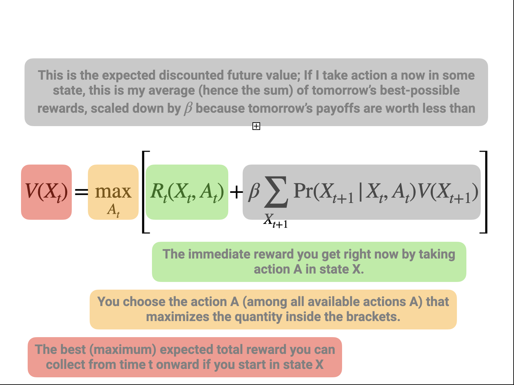
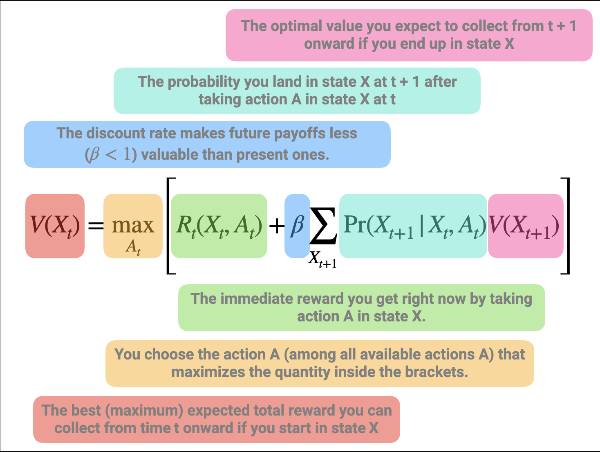

\linenumbers

\small

^1^ CEFE, Univ Montpellier, CNRS, EPHE, IRD, Montpellier, France
^2^ address
^3^ address
^4^ address

`*` Corresponding author: olivier.gimenez@cefe.cnrs.fr

\normalsize

\vspace{1cm}
\hrule

Invasive species (IAS) pose significant ecological, economic, and public health challenges. Robust methods are needed for guiding effective management. Overall, we hope to demonstrate the flexibility and utility of structured decision making in invasive species management. 

Target journal: Biological invasions? NeoBiota?.

\vspace{3mm}
\hrule
\vspace{5mm}

*Keywords*: Adaptive management, Invasive species, Stochastic dynamic programming, Structured decision making

\newpage

```{r setup, include=FALSE, cache=FALSE, message = FALSE}
library("knitr")
opts_chunk$set(echo = FALSE, warning = TRUE, message = TRUE)
opts_chunk$set(tidy = TRUE, comment = NA, highlight = TRUE)
opts_chunk$set(fig.path = "output/figures/")
```


```{r knitcitations, cache = FALSE}
library(knitcitations)
cleanbib()   
cite_options(citation_format = "pandoc")
```

# Introduction

Invasive species are a significant global issue, with wide-ranging impacts on ecosystems, economies, and public health [@Roy2024; @Petr2020]. 

Effective management of invasive species requires blabla for guiding control efforts and evaluating the success of eradication or regulation programs [@Thompson2021; @Williams2002]. 

Pitch: Structured decision-making (SDM) and adaptive management (AM) have been repeatedly recommended for the management of invasive species, yet they remain underused in practice. There are many reasons for this gap, one of which is the technical challenge of formally identifying and quantifying trade-offs among management objectives. Here, we contribute to ongoing efforts by illustrating the use of stochastic dynamic programming (SDP) and some of its variants — including active and passive adaptive management and partially observable Markov decision processes (POMDPs) — across different ecological contexts (a single population, a metapopulation, and two interacting populations).

Several papers have recommended or implemented structured decision-making (SDM) for managing invasive species. It’s worth providing a short review of this literature.

In a recent review on impacts, the use of ML to guide management actions identified as a future research direction (see Appendix 3 in @Haubrock2025). 

"Another recent research direction is the use of machine learning to aid the development of conservation management strategies. These methods involve models that integrate geospatial, climate, species distribution and other data to simulate the distribution of species and vegetation types under different land use and conservation planning scenarios. Reinforcement Learning algorithms can then be used to learn a management policy that attains a specified quantifiable objective (such as minimising the number of individuals from a non-native species) under constraints such as cost or the amount of land that can be protected. Dietterich, Taleghan and Crowley (2013) demonstrated how Reinforcement Learning can be applied to managing a river system to control the expansion of a non-native plant species. Lapeyrolerie et al. (2022) demonstrated the potential of Reinforcement Learning for resource management problems, such as setting fishing quotas. Conservation area prioritisation through artificial intelligence (CAPTAIN) (Silvestro et al., 2022) is a general simulation framework that allows the user to define flexibly management objectives to be optimised. The unprecedented rate at which new technologies are emerging holds great promise for improving impact assessments related to biological invasions."

Coypu (Myocastor coypu) as a case study throughout the paper. Code and tutorials available as appendices. 

Add a shiny for each case study so that folks can play around?

# A primer on structured decision making 

We do not want to rewrite Lucile's paper... 

## Why and what (all)





## Stochastic dynamic programming (Olivier)

Here we present a minimal stochastic dynamic programming (SDP) example. The aim is purely pedagogical: to show how states, actions, transition probabilities, rewards, and time horizon combine to produce an optimal decision rule. 

We consider a stylized invasion management problem with three qualitative states describing the invasion level:

- Eradicated: no individuals detected (possible re-invasion risk)
- Contained: invasion present but at low abundance
- Established: invasion widespread with high impacts

At each time step, the manager chooses between two actions:

- Monitor: surveillance only (low cost, little effect)
- Control: active management campaign (higher cost, improves state)

State dynamics are described by action-dependent transition matrices

\[
P_a(s,s') = \Pr(S_{t+1}=s' \mid S_t=s,\; A_t=a).
\]

Transition matrices describe how the invasion state evolves probabilistically from one time step to the next under each management action. Each row corresponds to the current state and each column to the next state, with entries giving transition probabilities. We build a transition matrix for each action. 

Under monitoring, the transition is: 

\[
P_{\text{Monitor}} =
\begin{array}{c|ccc}
 & \text{Erad.} & \text{Cont.} & \text{Estab.} \\
\hline
\text{Erad.} & 0.95 & 0.05 & 0.00 \\
\text{Cont.} & 0.00 & 0.80 & 0.20 \\
\text{Estab.} & 0.00 & 0.00 & 1.00 \\
\end{array}
\]

If the system is eradicated, it remains so with probability 0.95 but may revert to a contained state with probability 0.05, reflecting a small risk of re-invasion. When the invasion is contained, it persists with probability 0.80 but may deteriorate to an established state with probability 0.20, indicating possible population growth without intervention. Once established, the system remains established with probability 1, meaning monitoring alone cannot reverse the invasion. 

In contrast, control shifts the system toward better states:

\[
P_{\text{Control}} =
\begin{array}{c|ccc}
 & \text{Erad.} & \text{Cont.} & \text{Estab.} \\
\hline
\text{Erad.} & 0.98 & 0.02 & 0.00 \\
\text{Cont.} & 0.20 & 0.75 & 0.05 \\
\text{Estab.} & 0.05 & 0.75 & 0.20 \\
\end{array}
\]

From an eradicated state, the system remains eradicated with probability 0.98 and only rarely becomes contained (0.02). When contained, control can eradicate the population (0.20), maintain it at low levels (0.75), or fail and allow establishment (0.05). Finally, when the invasion is established, control improves the situation in most cases, leading to a contained state with probability 0.75, occasionally achieving eradication (0.05), but sometimes failing to reduce impacts (remaining established with probability 0.20). 

Together, these transition matrices encode both ecological uncertainty and the imperfect effectiveness of management actions.

Next we define rewards. Rewards are defined as the negative of total costs, so that maximizing expected reward is equivalent to minimizing management and damage costs. 

\[
R(s,a) = -(\text{damage}(s) + \text{cost}(a)).
\]

Damage depends on the invasion state (higher when the invasion is established), while management cost depends on the chosen action (higher for active control than monitoring). The reward matrix is constructed by combining these two components for all state–action pairs, yielding the immediate payoff used in the dynamic programming recursion.

\[
R =
\begin{array}{c|cc}
 & \text{Monitor} & \text{Control} \\
\hline
\text{Erad.} & -1  & -6  \\
\text{Cont.} & -5  & -10 \\
\text{Estab.} & -15 & -20 \\
\end{array}
\]

(Rows correspond to the current invasion state and columns to the management action.)

For example, when the invasion is eradicated, monitoring yields a reward of -1, reflecting only minor surveillance costs, whereas applying control in the same state yields -6 due to higher intervention costs. When the population is contained, rewards are -5 for monitoring and -10 for control, representing moderate damages combined with the respective management costs. Finally, when the invasion is established, rewards drop to -15 under monitoring and -20 under control, reflecting both high ecological impacts and, in the latter case, substantial intervention effort. Overall, this reward structure captures the short-term trade-off between ecological impacts and management effort that underlies the decision problem.

Solving the finite-horizon decision problem yields the optimal value function $V_t(s)$, which represents the expected cumulative reward (i.e., negative total cost) obtained when starting from state $s$ at time $t$ and following the optimal policy thereafter. Values are more negative when the invasion is established, reflecting higher expected damages. Moreover, values increase (become less negative) as the horizon shortens because fewer future costs can accumulate. 

\[
V_t(s) =
\begin{array}{c|cccccc}
 & t=1 & t=2 & t=3 & t=4 & t=5 & t=6 \\
\hline
s = \text{Erad.} & -7.60 & -5.50 & -3.69 & -2.20 & -1 & 0 \\
s = \text{Cont.} & -33.78 & -27.43 & -19.96 & -12.0 & -5 & 0 \\
s = \text{Estab.} & -49.26 & -42.05 & -34.47 & -26.8 & -15 & 0 \\
\end{array}
\]

The associated optimal policy $\pi_t(s)$ specifies the best action to take in each state $s$ at each time step $t$. Overall, the policy indicates that monitoring is typically optimal when the system is eradicated, whereas control is recommended when the invasion is established due to the high expected damages. In the contained state, the optimal decision varies with the time horizon, reflecting the trade-off between immediate intervention costs and the risk of future deterioration.

\[
\pi_t(s) =
\begin{array}{c|ccccc}
 & t=1 & t=2 & t=3 & t=4 & t=5 \\
\hline
s =\text{Erad.} & \text{Monitor} & \text{Monitor} & \text{Monitor} & \text{Monitor} & \text{Monitor} \\
s = \text{Cont.} & \text{Control} & \text{Control} & \text{Monitor} & \text{Monitor} & \text{Monitor} \\
s = \text{Estab.} & \text{Control} & \text{Control} & \text{Control} & \text{Control} & \text{Monitor} \\
\end{array}
\]

This toy example highlights key features of SDP:

- **State dependence**: optimal decisions depend on invasion level.
- **Trade-off**: control is costly but reduces future risk.
- **Time horizon effects**: as the horizon shortens, actions may become more short-term oriented.
- **Uncertainty**: decisions account for probabilistic transitions, not deterministic outcomes.


# Case studies with coypus

## Single population (Olivier)

Take wolf example and turn it into a coypu example ?

## Two interacting species (Lucile)

Competition or predator-prey, or host-pathogen / disease thing. See SDP-species-interactions/ in Olivier biblio repo.

## Metapopulation (Olivier)

# Acounting for uncertainty

## POMDP (Cassie)

Illustrate POMDP, Olivier has some code extending the computer maintenance example from above. 

<https://besjournals.onlinelibrary.wiley.com/doi/10.1111/2041-210X.14374>

<https://besjournals.onlinelibrary.wiley.com/doi/10.1111/2041-210X.13692>


## Adaptive management (Abby)

When is it useful. Start with value of information? 

On a single species ; check out Conroy's book, there is a nice figure illustrating AM. 

<https://onlinelibrary.wiley.com/doi/10.1002/ece3.71176>

# Discussion (all)

## Main messages

How is SDM relevant. 

## Limitations

Curse of dimensionality.

## Perspectives

# Acknowledgments

## Data availability statement

Data and code are available at \href{https://github.com/oliviergimenez/SDPaper}{https://github.com/oliviergimenez/SDPaper}.

# References

::: {#refs}
:::

